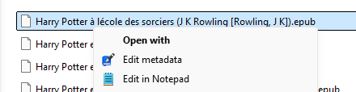
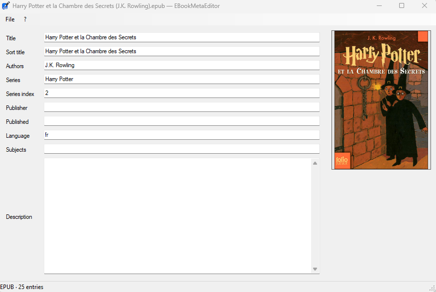
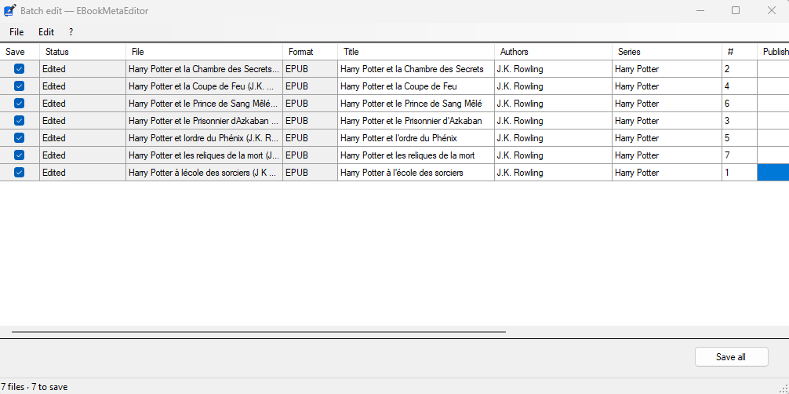

# EBookMetaEditor

A fast, batch-friendly metadata editor for ebooks and comics on Windows.

Ebook metadata is messy. Different formats use different field names, metadata is often incomplete or invalid, and after importing a library into tools such as Kavita, something as basic as searching by author may not work as expected.

**EBookMetaEditor** lets you edit metadata directly from Windows Explorer — without importing your books into another application first. It can update an entire library in batch and, while saving, fixes metadata and XML issues it encounters so the resulting files import cleanly into Kavita and other readers.



Right-click a book in Explorer and choose **Edit metadata** to open it — no import, no database.



The single-file editor shows every field the format can store, plus the cover.

## Why EBookMetaEditor?

There are already excellent ebook-management tools, but none quite matched the workflow I wanted:

* **Edit files directly from Explorer.** No library import or database required.
* **Batch-edit an entire collection.** Select multiple files, open a folder, or paste values across dozens of books at once.
* **Support the formats I actually use.** EPUB, CBZ, CBT, CBR, FB2, MOBI, AZW, and AZW3.
* **Write metadata correctly.** The editor does not just insert values into an OPF or `ComicInfo.xml`; it validates and normalizes the surrounding metadata where possible.
* **Avoid pretending formats support things they do not.** Fields that cannot be stored safely are disabled instead of being silently discarded or written into undocumented locations.

## Supported formats

| Format     | Read | Write | Container | Metadata stored in   |
| ---------- | ---- | ----- | --------- | -------------------- |
| EPUB 2 / 3 | ✅    | ✅     | ZIP       | OPF package document |
| CBZ        | ✅    | ✅     | ZIP       | `ComicInfo.xml`      |
| CBT        | ✅    | ✅     | TAR       | `ComicInfo.xml`      |
| CBR        | ✅    | ⚙️     | RAR       | `ComicInfo.xml`      |
| FB2        | ✅    | ✅     | Plain XML | `<description>`      |
| FB2.ZIP    | ✅    | ✅     | ZIP       | `<description>`      |
| MOBI / PRC | ✅    | ✅     | PalmDB    | EXTH records         |
| AZW / AZW3 | ✅    | ✅     | PalmDB    | EXTH records         |

**⚙️ CBR reads on its own; saving one needs WinRAR installed.**.
So EBookMetaEditor reads CBR files out of the box, and to save one it uses the `Rar.exe` that comes with WinRAR:
it looks for your WinRAR installation in the registry, then for `rar.exe` on your `PATH`.

**Not supported:** CB7, PDF, KFX, AZW4, LIT, PDB, RB, DjVu, and audiobooks.

## Editable metadata

Not every format can store the same metadata. EBookMetaEditor disables fields that a particular file cannot preserve rather than accepting a value that would later be lost.

| Field                    | EPUB         | CBZ / CBT / CBR | FB2       | MOBI / AZW3  |
| ------------------------ | ------------ | ------------ | ------------ | ------------ |
| Title                    | read + write | read + write | read + write | read + write |
| Sort title               | read + write | —            | —            | —            |
| Authors                  | read + write | read + write | read + write | read + write |
| Author sort names        | read + write | —            | —            | —            |
| Author roles             | read + write | read + write | read + write | —            |
| Series                   | read + write | read + write | read + write | —            |
| Series index             | read + write | read + write | read + write | —            |
| Description              | read + write | read + write | read + write | read + write |
| Publisher                | read + write | read + write | read + write | read + write |
| Publication date         | read + write | read + write | read + write | read + write |
| Modification date        | read + write | —            | —            | —            |
| Language                 | read + write | read + write | read + write | read + write |
| Subjects / tags          | read + write | read + write | read + write | read + write |
| Identifiers (ISBN, etc.) | read + write | —            | read         | read         |
| Rights                   | read + write | —            | —            | read + write |
| Cover image              | read + write | read         | read         | read         |

### Format-specific notes

**Cover replacement is currently EPUB-only.**
In other formats, the cover may be a page image, a base64 blob embedded in the book's XML, or an entire database record. Modifying page content is deliberately outside the scope of the editor.

**MOBI has no writable series field.**
There is no EXTH record for series metadata that can be verified against the published format documentation. Writing an assumed record number risks placing the series value into a field with an entirely different meaning, so the field is disabled instead.

**MOBI language is read from EXTH 524 only.**
The numeric locale stored in the MOBI header is not used as a fallback because converting it back into a reliable language tag would require guesswork.

## Batch editing

There are several ways to open multiple files:

* Select files in Windows Explorer and choose **Edit metadata**.
* Drag and drop a folder onto the application.
* Choose **File ▸ Batch edit folder…**.

The batch editor opens one window with a row for each file and a column for each editable field.



### Spreadsheet-style copy and paste

Edit cells directly, or use `Ctrl+C` and `Ctrl+V` just like you would in a spreadsheet.

A single copied value can be pasted into every selected cell. For example, copy a publisher once, select thirty cells in the Publisher column, and paste.

You can also copy and paste rectangular blocks of data. Blocks copied from applications such as Excel fill cells across and down.

Copy and paste are also available from the **Edit** menu and the right-click context menu.

### Safe batch saves

**Save all** writes only files you actually changed.

Unmodified files are not rewritten — they are not even opened for writing. Every modified file also keeps a `.bak` backup.

Each row reports its own result, so one bad file does not stop the rest of the batch. For example:

* A `.cbz` that is actually a 7z archive is reported as unsupported, by name.
* A `.cbz` that is actually a RAR opens as a CBR, and the mismatch is still reported.
* A CBR row reads and edits like any other; on save it either goes through the `Rar.exe` found on the machine or reports that the save failed.
* A DRM-protected AZW is reported as non-editable.
* A file that fails to save fails independently without aborting the remaining files.

Unsupported fields are disabled per row. A comic's Sort Title cell can therefore be unavailable while the EPUB beside it remains editable.

**Description and cover art are intentionally excluded from the batch grid.** Double-click a file name to open that book in the single-file editor.

## Installation

1. Download the latest release.
2. Extract it anywhere.
3. Run `EBookMetaEditor.exe`.

That's it.

EBookMetaEditor is distributed as a single executable and does not require an installer. It runs on a clean Windows 10 or Windows 11 system.

### Add EBookMetaEditor to the Explorer context menu

Open **File ▸ Settings** and click **Add to context menu**.

You can choose which supported extensions receive the Explorer entry, allowing you to enable it for comics, ebooks, or both.

> **Note about `.fb2.zip`:** Windows can associate a context-menu verb only with a single file extension. Registering `.fb2.zip` would therefore mean registering `.zip`, which would add EBookMetaEditor to the context menu for every ZIP archive on the machine.
>
> Open `.fb2.zip` files by dragging them onto the application or by choosing **File ▸ Open** instead.

## Building from source

```bash
git clone https://github.com/o0Zz/EBookMetaEditor
cd EBookMetaEditor
dotnet build
dotnet test
dotnet build src/EBookMeta.App -c Release
```

Any recent .NET SDK should work.

The projects use the SDK-style project format and target `net48` through the `Microsoft.NETFramework.ReferenceAssemblies` package. As a result, neither Visual Studio nor the .NET Framework targeting pack is required to build the project.
